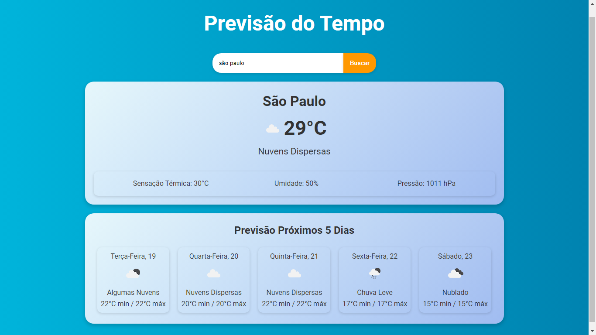

# ⛅ React Previsão

Um aplicativo web de previsão do tempo desenvolvido com React.



## 🚀 Tecnologias Utilizadas
- ⚛️ React.js
- 🌍 API de Previsão do Tempo (exemplo: OpenWeatherMap)

## 📌 Funcionalidades
- 🔍 Busca de previsão do tempo por cidade.
- 🌡️ Exibição de temperatura, umidade e condição climática.
- 📱 Interface responsiva e intuitiva.

## 🛠 Como Executar o Projeto

1. 📥 Clone o repositório:
   ```sh
   git clone https://github.com/kalebemax/react-previsao.git
   ```

2. 📂 Acesse o diretório do projeto:
   ```sh
   cd react-previsao
   ```

3. 📦 Instale as dependências:
   ```sh
   npm install
   ```

4. 🔧 Obtenha uma chave de API para previsão do tempo (exemplo: OpenWeatherMap) e adicione ao arquivo `.env`:
   ```sh
   REACT_APP_API_KEY=SUA_CHAVE_AQUI
   ```

5. ▶️ Inicie o projeto:
   ```sh
   npm start
   ```

